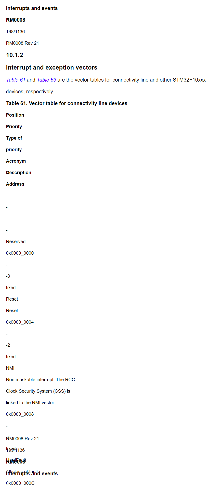
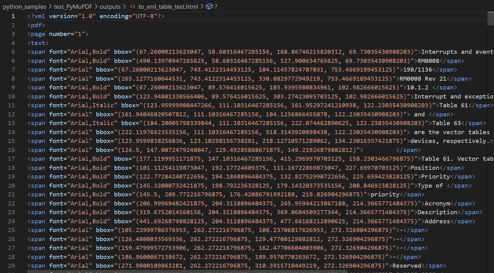
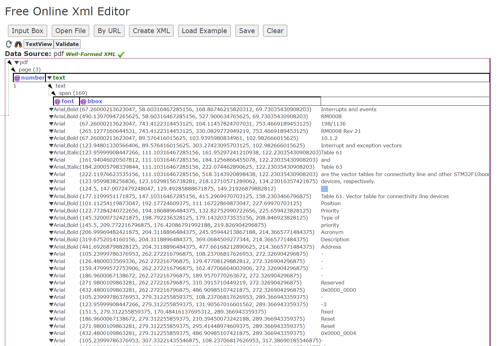

### 安装

```
pip install PyMuPDF
或者pip3 install PyMuPDF

pip install tqdm
或者pip3 install tqdm
```

参考代码：https://blog.csdn.net/qq_28505809/article/details/124147552或者https://stackoverflow.com/questions/71812718/convert-pdf-to-html-via-pymupdf

### 转html的结果


看到这个结果，我就笑笑

### 转xml的结果


通过在线 XML 元素查看器查看

不过多评价，和pdfminer.six转换的差不多

