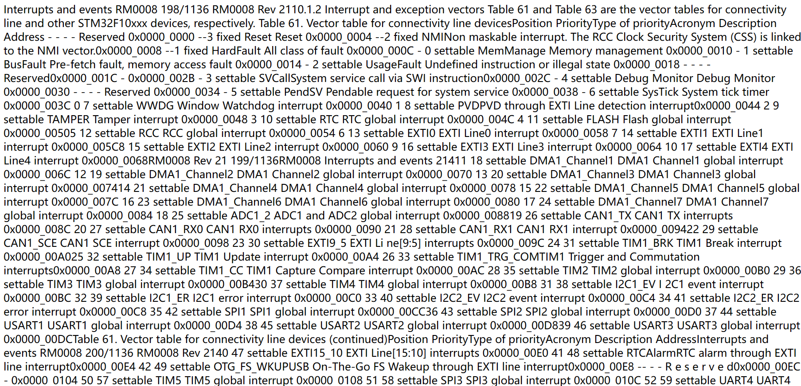

[toc]

# PyPDF2 使用体验与评估

> Github 阅读：[https://github.com/shandianchengzi/PDF2HTML_Samples/blob/main/results/PyPDF2.md](https://github.com/shandianchengzi/PDF2HTML_Samples/blob/main/results/PyPDF2.md)  
> CSDN 阅读：[](https://blog.csdn.net/qq_46106285/article/details/待补充)  

> 参考：[Extract Text from a PDF — PyPDF2 documentation](https://pypdf2.readthedocs.io/en/3.x/user/extract-text.html)

## 1 安装指南

要使用 PyPDF2，您可以通过 Python 的包管理工具 pip 进行安装。在命令行中执行以下命令：

```bash
pip install PyPDF2
```

## 2 测试代码

为了帮助您更好地理解 PyPDF2 的用法，我提供了一个测试代码示例。您可以在以下 GitHub 仓库中找到相关代码和样本文件：[https://github.com/shandianchengzi/PDF2HTML_Samples/tree/main/python_samples/test_PyPDF2](https://github.com/shandianchengzi/PDF2HTML_Samples/tree/main/python_samples/test_PyPDF2)

其目录结构如是：


## 3 测试结果

### 3.1 转 HTML 的结果

[Extract Text from a PDF — PyPDF2 documentation](https://pypdf2.readthedocs.io/en/3.x/user/extract-text.html) 在官方介绍文档中没有看到 PyPDF2 能直接将 PDF 转换成 HTML，于是在 to_html.py 中采用 extract_text 提取文本再写入到 HTML 文件中，最后转换的效果可想而知



### 3.2 转 XML 的结果

和转 HTML 类似，先用 extract_text 提取PDF中的文本，然后使用 Python 的 xml.etree.ElementTree 库将其转换为 XML 格式，转换的结果和转 HTML 中的图一样

## 总体评价：✅⭐

PyPDF2 在网上查找的资料都是对 PDF 文件进行操作，比如写入、分割、合并PDF文档等等，更多使用方法见

[掌握PDF文件处理的神器：Python PyPDF2库详解-CSDN博客](https://blog.csdn.net/weixin_68789096/article/details/134799118)

[欢迎使用 PyPDF2 — PyPDF2 文档](https://pypdf2.readthedocs.io/en/3.x/index.html)

根据上面的转换结果，本人不建议用这个工具来将 PDF 转换成 HTML/XML（当然可能是还有别的转换方法只是本人没找到