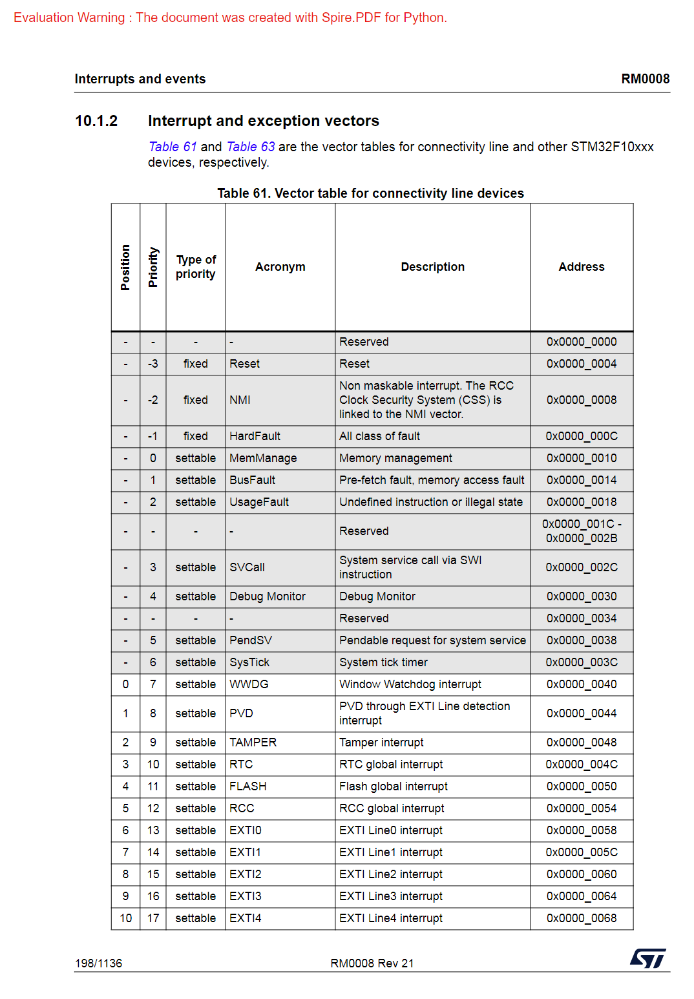
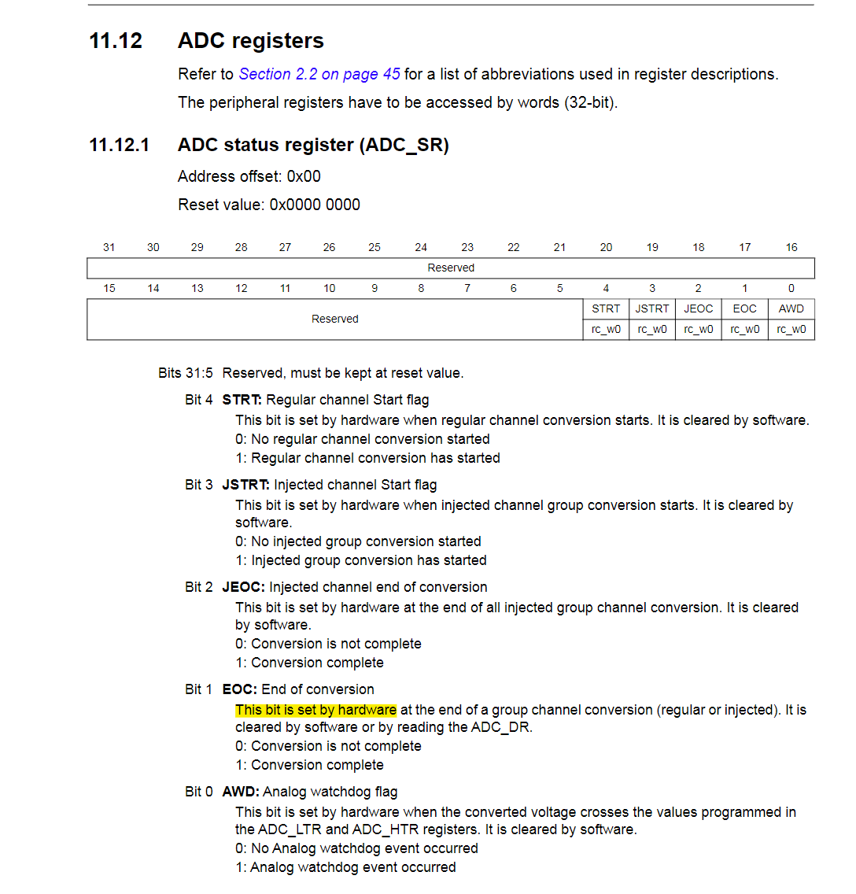

### 安装

```
pip install Spire.PDF
```

### 转 html 的结果



还行吧，就是有点小，还没有大纲，没找到相关的参数可以让它放大一点

另外试用版会添加下面的红色水印，而且仅支持转换前 10 页到其它格式，要解除功能限制得购买并应用 license

<font color='red'>Evaluation Warning : The document was created with Spire.PDF for Python.</font>

不过它可以免费试用一个月相关要求见[Spire.PDF for Python | 下载 (e-iceblue.cn)](https://www.e-iceblue.cn/Downloads/Spire-PDF-Python.html)

