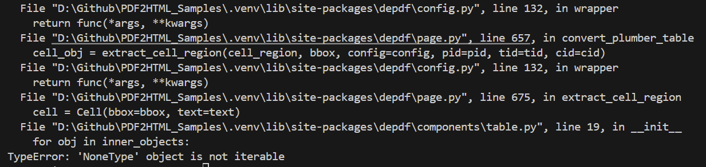
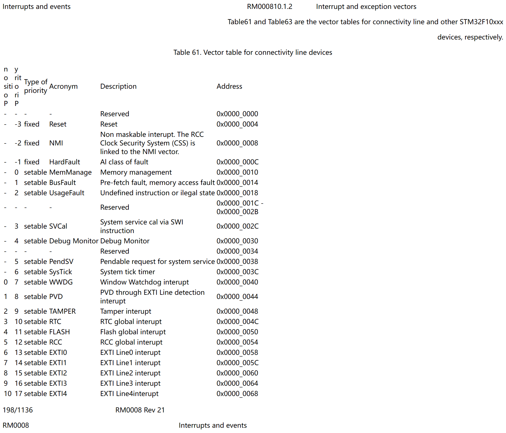
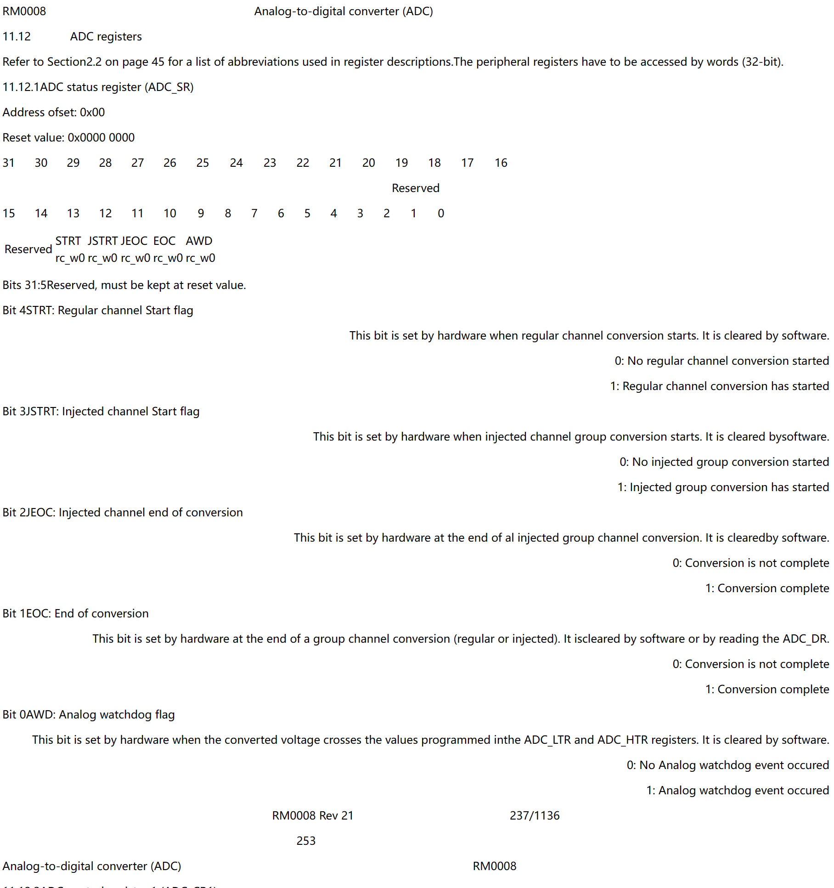

### 安装

```
pip install depdf
```

### 转 html 的结果

运行`python tools.py test depdf html`，出现以下报错



参照https://blog.csdn.net/qq_42780289/article/details/96971940 中的解决方法，定位到图中的`table.py`的第20行处，进行修改

先判断迭代对象是否为空

```python
if inner_objects:
	for obj in inner_objects:
		self.html += getattr(obj, 'html', '')
```

修改后再次运行，得到转换成的html如下所示





转换没有了原来的格式，和pdftotree转换的效果类似，能看但效果一般，不太能分清PDF各个章节

另外`to_html.py`中注释掉的还有两种方式，一种方式效果一样，一种转换的非常不好，整页都是文本信息，没有任何原来的格式
