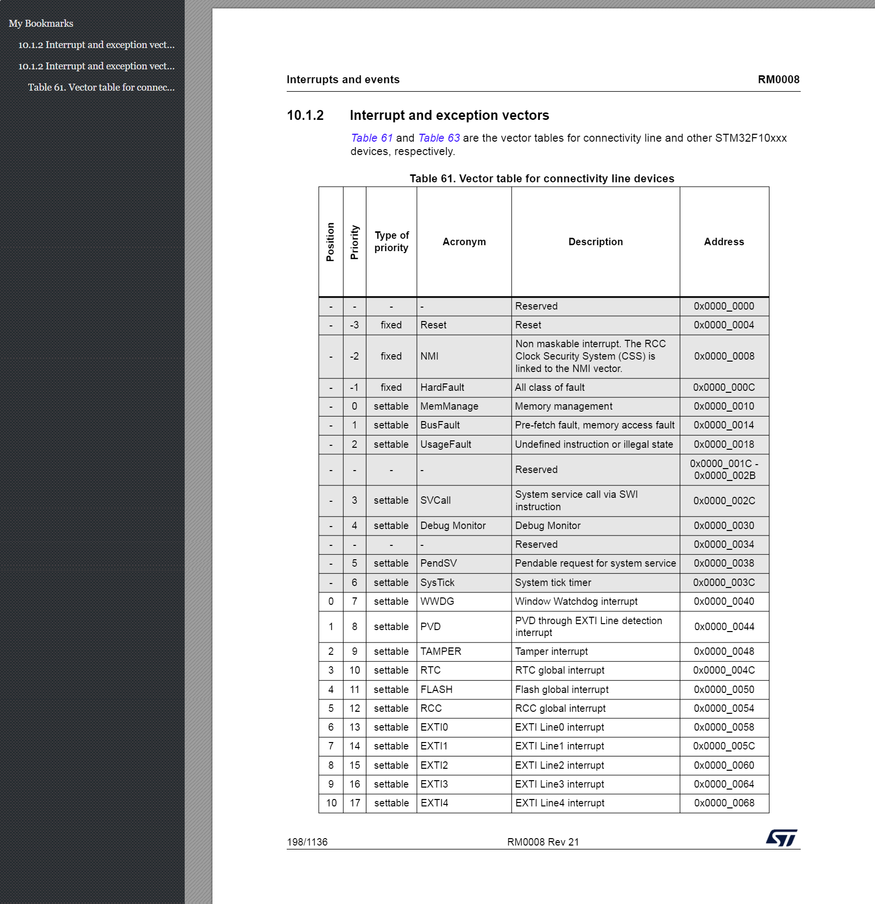
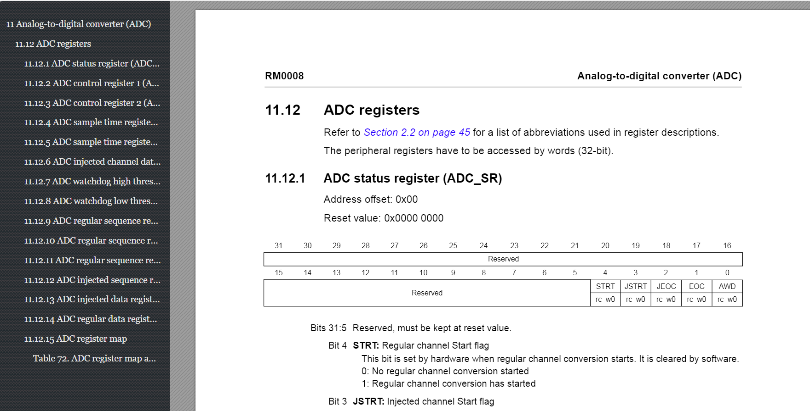

### 安装
[pdf2htmlEX Windows Version | RubyPdf Technologies](https://soft.rubypdf.com/software/pdf2htmlex-windows-version)
下载的工具已经放在test_pdf2htmlEX/pdf2htmlEX中

### 运行注意事项

这个工具使用的时候，文件路径一定要设置好
如果直接使用to_html.py中的output_file_path作为输出文件路径，会报错
`Error: Cannot open ./D:\Github\PDF2HTML_Samples\python_samples\test_pdf2htmlEX\outputs\to_html_table_test.html for writing`

### 转 html 的结果

如这两张图，不得不说转换的还是挺好的，只是图一的大纲有点问题（两个10.1.2节）

