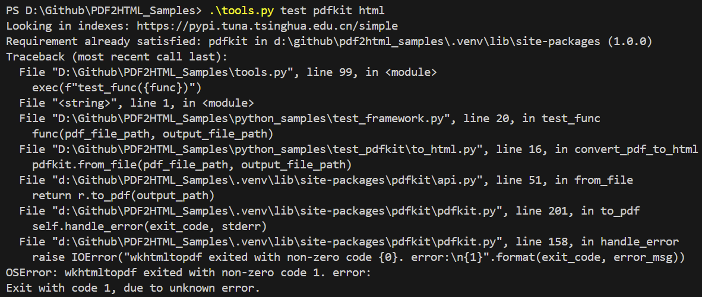

### 安装

```
pip install pdfkit
```

[PDFKit](https://pdfkit.org/)中说用`npm install pdfkit`安装，但我试过pip也能安装

还需要安装wkhtmltopdf，并将bin添加到环境变量中，需重启后生效

下载链接：[Installing wkhtmltopdf · JazzCore/python-pdfkit Wiki (github.com)](https://github.com/JazzCore/python-pdfkit/wiki/Installing-wkhtmltopdf)

后面运行出现报错



下面两篇文章有记录类似报错，但转换的格式不一样

[格式转化工具集之pdfkit错误_wkhtmltopdf exited with non-zero code 1. error:-CSDN博客](https://blog.csdn.net/python__reported/article/details/108168094)

[Python使用pdfkit、wkhtmltopdf将html转换为pdf错误记录文档_qpainter::begin(): returned false-CSDN博客](https://blog.csdn.net/u012561176/article/details/83655247)

