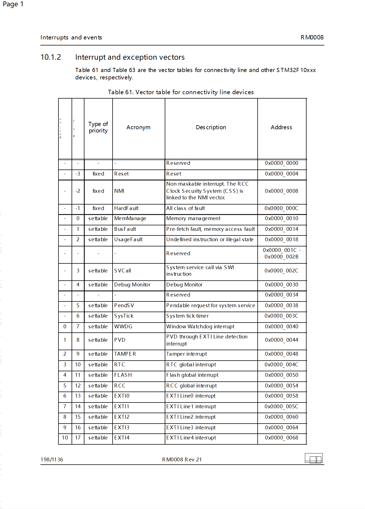
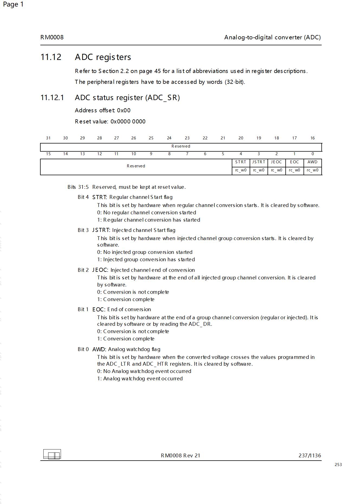
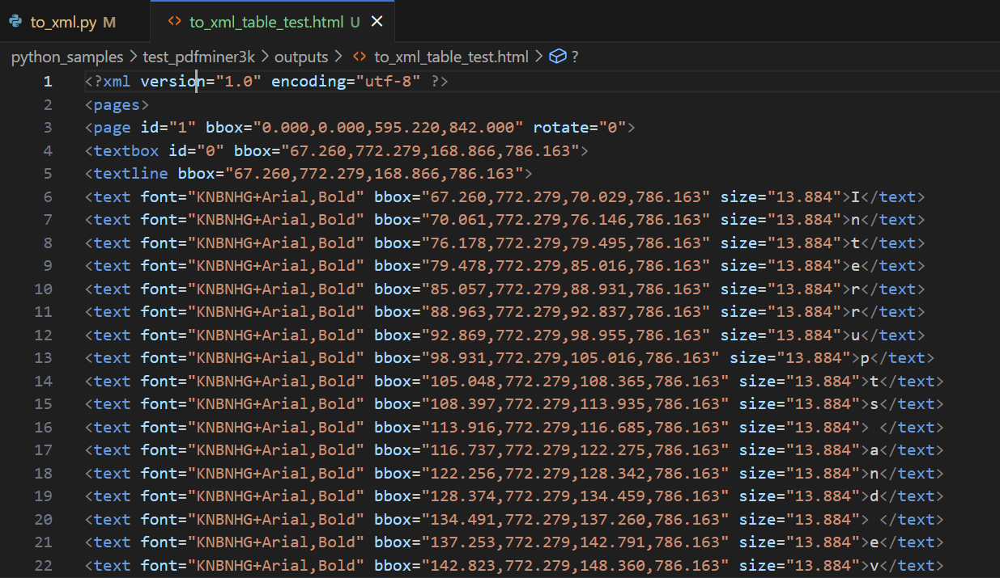

[toc]

# pdfminer3k 使用体验与评估

> Github 阅读：[https://github.com/shandianchengzi/PDF2HTML_Samples/blob/main/results/pdfminer3k.md](https://github.com/shandianchengzi/PDF2HTML_Samples/blob/main/results/pdfminer3k.md)  
> CSDN 阅读：[](https://blog.csdn.net/qq_46106285/article/details/待补充)  

> 参考：[4.6. 使用 pdfminer3k 模块提取PDF文件内容 — Python 3 教程 文档 (osgeo.cn)](https://www.osgeo.cn/python-tutorial/pdf-pdfminer.html#id3)

## 1 安装指南

PDFMiner 内置两个好用的工具：pdf2txt.py 和 dumppdf.py，转换均使用的 pdf2txt.py ，而要使用这个工具需要下载源码，在 github https://github.com/jaepil/pdfminer3k 上下载 ZIP，解压后在目录下使用 `pip install .`安装，即可使用 pdf2txt.py 工具。

## 2 测试代码

为了帮助您更好地理解 pdfminer3k 的用法，我提供了一个测试代码示例。您可以在以下 GitHub 仓库中找到相关代码和样本文件：[https://github.com/shandianchengzi/PDF2HTML_Samples/tree/main/python_samples/test_pdfminer3k](https://github.com/shandianchengzi/PDF2HTML_Samples/tree/main/python_samples/test_pdfminer3k)

其目录结构如是：


## 3 测试结果

### 3.1 转 HTML 的结果

pdf2txt.py 工具提供了一些转换参数，可参考[4.6. 使用 pdfminer3k 模块提取PDF文件内容 — Python 3 教程 文档 (osgeo.cn)](https://www.osgeo.cn/python-tutorial/pdf-pdfminer.html#pdf2txt-py)

转换结果如下图所示





还行，有一些地方还是无法解析，比如下方那个图标

转换时会报错

```bash
WARNING:root:Cannot locate objid=147
WARNING:pdfminer.layout:Too many boxes (362) to group, skipping.
```

这些警告可能是由于 PDF 中包含大量的文本框或元素，PDFMiner 在处理过程中无法完全解析它们而产生的。

### 3.2 转 XML 的结果

如图，只是转换成了 `<text>` 元素



## 总体评价：✅⭐⭐⭐

转换成 HTML 还行，但 XML 不太行       