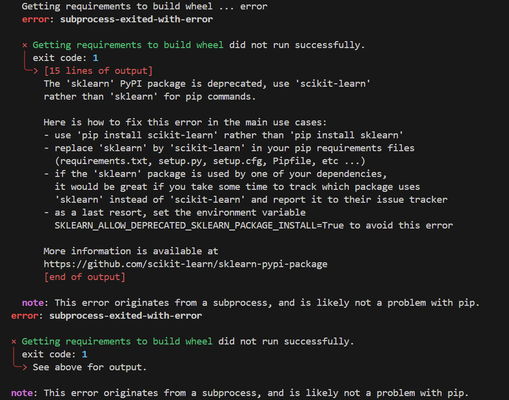
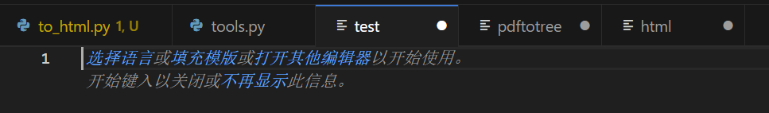

### 安装

直接`pip install pdftotree`，出现下面的报错

有人说低版本的Python不会出现这个问题（我也不确定），如果没有出现更好，出现了可以采用下面的方法解决

- 下载源代码[pdftotree · PyPI](https://pypi.org/project/pdftotree/#files)，我下载的是`pdftotree-0.5.0.tar.gz` 
- 解压后在`setup.py`中找到`install_requires`，将其中的`sklearn`修改为`scikit-learn`，保存
- 然后在解压目录下运行`pip install .`

### 转 html 的结果

运行没有报错，但是只生成了`test、pdftotree、html`三个空的文件？？？

看一下它的说明[pdftotree · PyPI](https://pypi.org/project/pdftotree/#description)

`Convert PDF into hOCR with text, tables, and figures being recognized and preserved`

这个hOCR 我也不知道是什么格式的文件，总之，就是这个工具应该不能用于转html