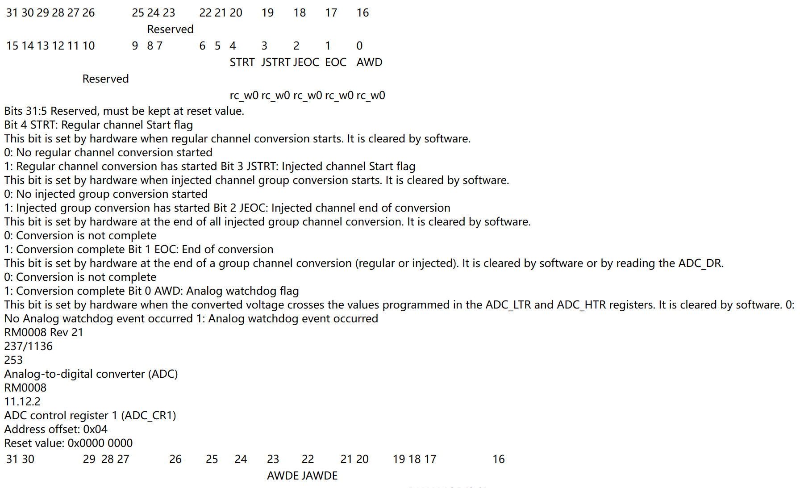

### 安装

直接`pip install pdftotree`，出现下面的报错


有人说低版本的Python不会出现这个问题（我也不确定），如果没有出现更好，出现了可以采用下面的方法解决

- 下载源代码[pdftotree · PyPI](https://pypi.org/project/pdftotree/#files)，我下载的是`pdftotree-0.5.0.tar.gz` 
- 解压后在`setup.py`中找到`install_requires`，将其中的`sklearn`修改为`scikit-learn`，保存
- 然后在解压目录下运行`pip install .`

### 转 html 的结果




上面是visualize参数设置成False的结果，没有了图表的格式和一些原有的结构

> chatgpt：在 pdftotree 中，visualize 参数用于控制是否在生成的HTML中包含用于可视化解析结果的额外信息。当 visualize 设置为 True 时，生成的HTML文件中会包含一些用于显示解析结果的额外标记或样式，例如文本边界框、文本块边界框等。

之后将`visualize`参数设置成`True`，运行，结果报错，需要下载**`Ghostscript`**，[Ghostscript : Downloads](https://ghostscript.com/releases/gsdnld.html)

`wand.exceptions.DelegateError: FailedToExecuteCommand "gswin64c.exe" ...`

下载之后又出现了另外的报错

`TypeError: width must be an integer, not 595.22`

然后又修改代码为

```python
pdftotree.parse(pdf_file_path, output_file_path, visualize=True, width=600)
```

但还是报错

`TypeError: parse() got an unexpected keyword argument 'width'`

看来`pdftotree.parse` 函数不支持 `width` 这个参数

后面在生成 HTML 后手动添加CSS样式（`to_html.py`中注释掉的部分），但是也只是改变了宽度，转换效果也没有提升，不知道还有没有别的方法可以使用`visualize`这个参数

### 总之

`visualize = False`：pdftotree转html没有了图表的格式和一些原有的结构（个人感觉有点像txt），能看但效果不太好，另外它的转换速度有点慢

`visualize = True`：未实现
