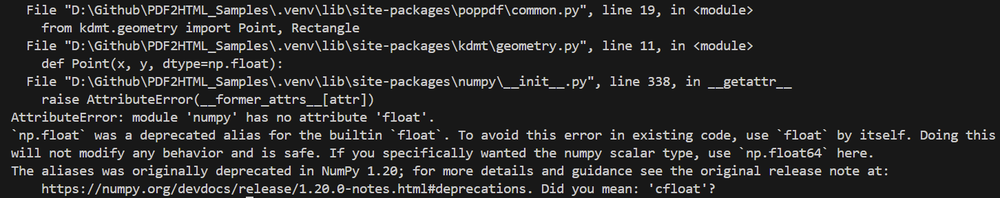
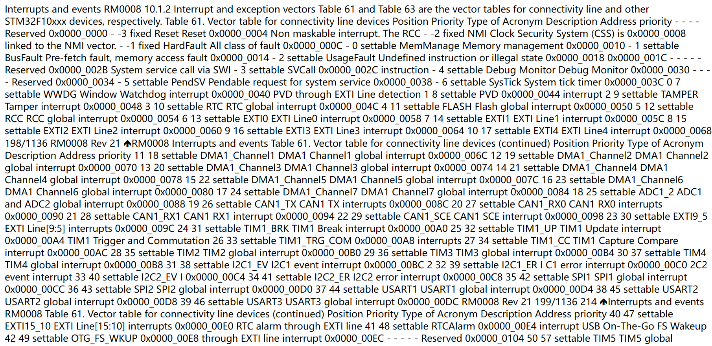
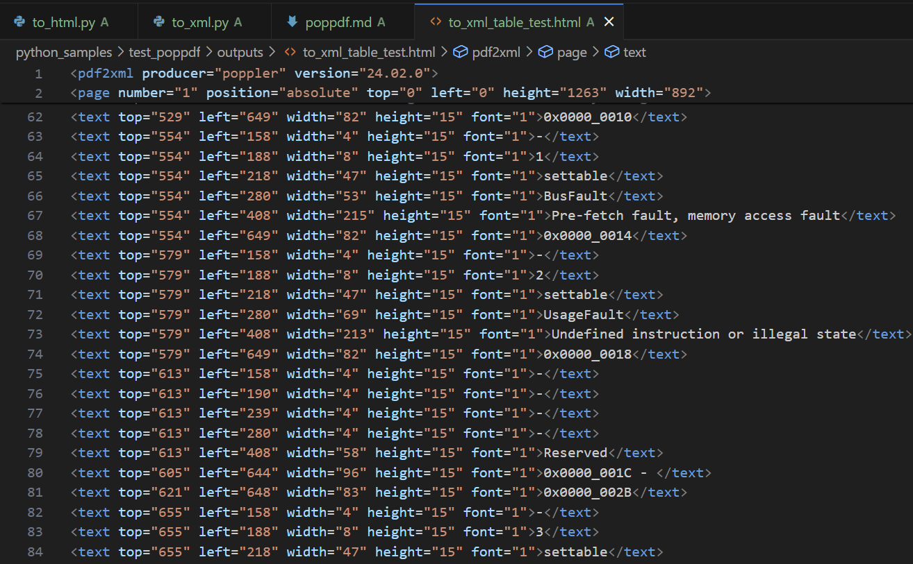

[toc]

# poppdf 使用体验与评估

> Github 阅读：[https://github.com/shandianchengzi/PDF2HTML_Samples/blob/main/results/poppdf.md](https://github.com/shandianchengzi/PDF2HTML_Samples/blob/main/results/poppdf.md)  
> CSDN 阅读：[](https://blog.csdn.net/qq_46106285/article/details/待补充)  

> 参考：[poppdf · PyPI](https://pypi.org/project/poppdf/)

## 1 安装指南

要使用 poppdf，您可以通过 Python 的包管理工具 pip 进行安装。在命令行中执行以下命令：

```bash
pip install poppdf
```

此外，还需要安装 poppler 的 windows 版本，下载链接[Releases · oschwartz10612/poppler-windows (github.com)](https://github.com/oschwartz10612/poppler-windows/releases/) ，下载完成后需将 bin 目录添加到环境变量中，并重启电脑

运行时可能会出现报错，提示缺少某个模块，只需要使用 pip install 命令安装即可

其中缺少 cv2 时，需要使用以下命令：

```bash
pip install opencv-python
```

另外，运行时会出现以下报错



解决方式：定位到图中的 geometry.py 相应位置，将 np.float 改为 np.float64 或者 np.cfloat

## 2 测试代码

为了帮助您更好地理解 poppdf 的用法，我提供了一个测试代码示例。您可以在以下 GitHub 仓库中找到相关代码和样本文件：[https://github.com/shandianchengzi/PDF2HTML_Samples/tree/main/python_samples/test_poppdf](https://github.com/shandianchengzi/PDF2HTML_Samples/tree/main/python_samples/test_poppdf)

其目录结构如是：


## 3 测试结果

### 3.1 转 HTML 的结果

也许是我没有找到正确的转换用法，转换时只是将 pdf 文本提取出来，保存在了 html 中，于是它的转换页面没有了原来的格式，全是文本信息，完全不能阅读，如下图所示：



### 3.2 转 XML 的结果



如图所示，只是将每个字符转换成 `<text>` 元素，实在难以阅读

## 总体评价：✅⭐

能转换，但是难以阅读，总感觉是我没找对这个工具的正确用法