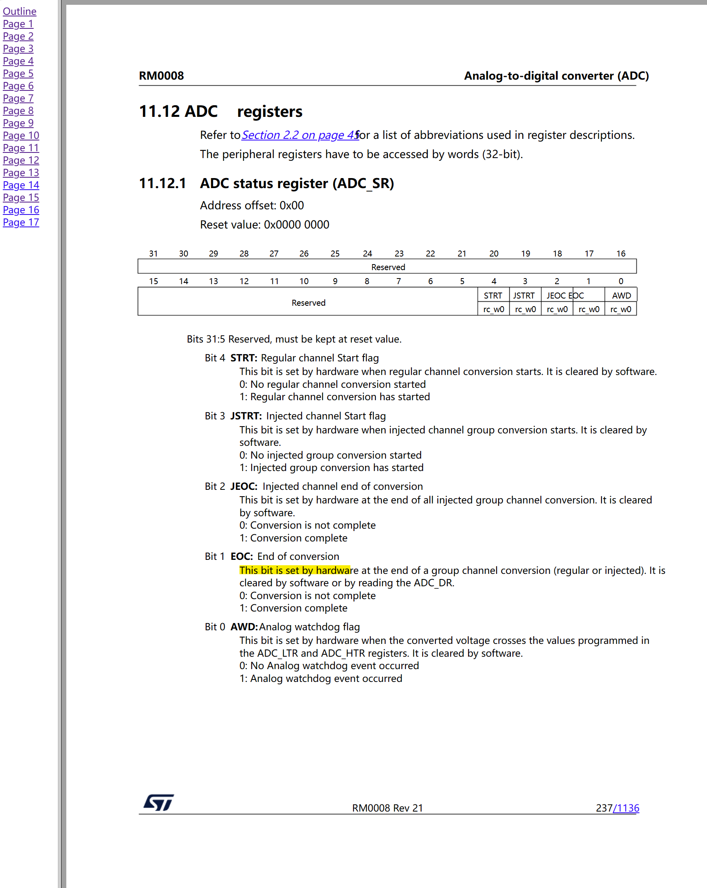
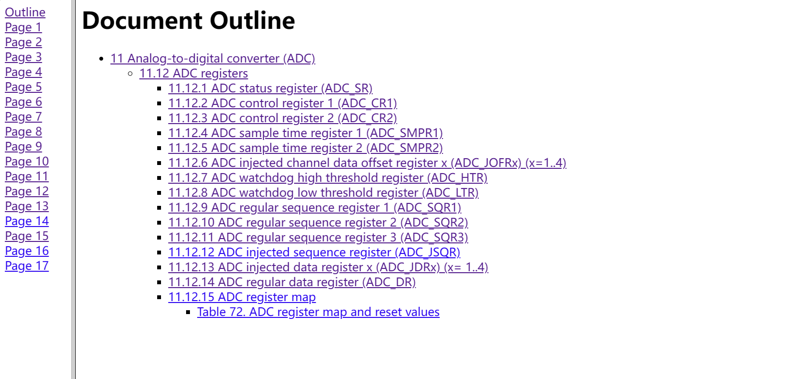
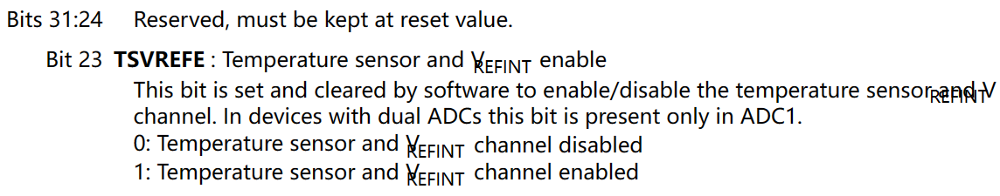
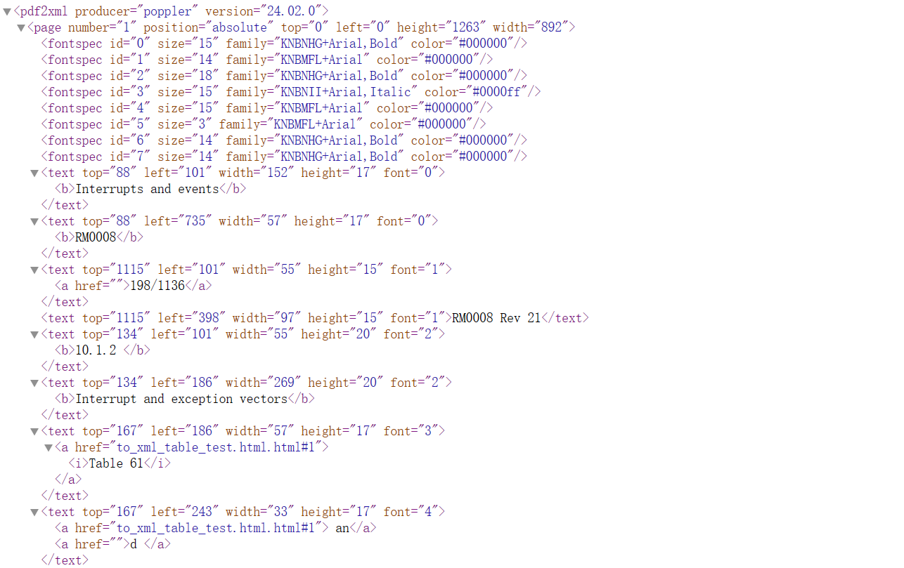

[toc]

# poppler 使用体验与评估

> Github 阅读：[https://github.com/shandianchengzi/PDF2HTML_Samples/blob/main/results/poppler.md](https://github.com/shandianchengzi/PDF2HTML_Samples/blob/main/results/poppler.md)  
> CSDN 阅读：[](https://blog.csdn.net/qq_46106285/article/details/待补充)  

## 1 安装指南

Windows 版本下载链接：[Releases · oschwartz10612/poppler-windows (github.com)](https://github.com/oschwartz10612/poppler-windows/releases/)，下载最新的 Release 24.02.0-0.zip，下载完成并解压后需要将 bin 目录添加到环境变量中，重启电脑后生效。

## 2 测试代码

为了帮助您更好地理解 poppler 的用法，我提供了一个测试代码示例。您可以在以下 GitHub 仓库中找到相关代码和样本文件：[https://github.com/shandianchengzi/PDF2HTML_Samples/tree/main/python_samples/test_poppler](https://github.com/shandianchengzi/PDF2HTML_Samples/tree/main/python_samples/test_poppler)

其目录结构如是：


## 3 测试结果

### 3.1 转 HTML 的结果

poppler 中的 pdftohtml 工具提供了一些参数，可以在命令行通过 `pdftohtml --help` 查看

所有参数我都列在了这里：

```
Usage: pdftohtml [options] <PDF-file> [<html-file> <xml-file>]
  -f <int>              : first page to convert
  -l <int>              : last page to convert
  -q                    : don't print any messages or errors
  -h                    : print usage information
  -?                    : print usage information
  -help                 : print usage information
  --help                : print usage information
  -p                    : exchange .pdf links by .html
  -c                    : generate complex document
  -s                    : generate single document that includes all pages
  -i                    : ignore images
  -noframes             : generate no frames
  -stdout               : use standard output
  -zoom <fp>            : zoom the pdf document (default 1.5)
  -xml                  : output for XML post-processing
  -noroundcoord         : do not round coordinates (with XML output only)
  -hidden               : output hidden text
  -nomerge              : do not merge paragraphs
  -enc <string>         : output text encoding name
  -fmt <string>         : image file format for Splash output (png or jpg)
  -v                    : print copyright and version info
  -opw <string>         : owner password (for encrypted files)
  -upw <string>         : user password (for encrypted files)
  -nodrm                : override document DRM settings
  -wbt <fp>             : word break threshold (default 10 percent)
  -fontfullname         : outputs font full name
```

在将 PDF 转换成 HTML 的过程中，我尝试了 `-s` 和 `-c` 参数，都生成了多个 html 文件，其中我认为转换效果最好的是 `-c` 参数生成的 to_html_table_test.html 和 to_html_txt_and_table_test.html 文件，下面展示部分转换后的页面





它的优点在于，不仅可以通过页面来实现跳转，还可以通过生成的一个包含所有章节的Outline来实现跳转，稍有不足的是一些特殊格式的文本数据没有转换的很好，例如 to_html_txt_and_table_test.html 的第五页




### 3.2 转 XML 的结果

同样，也是将每个字符转换成 `<text>` 元素，实在难以阅读



## 总体评价：✅⭐⭐⭐⭐

转换成 HTML 的效果还是非常好的，但 XML 就不太行了

​      